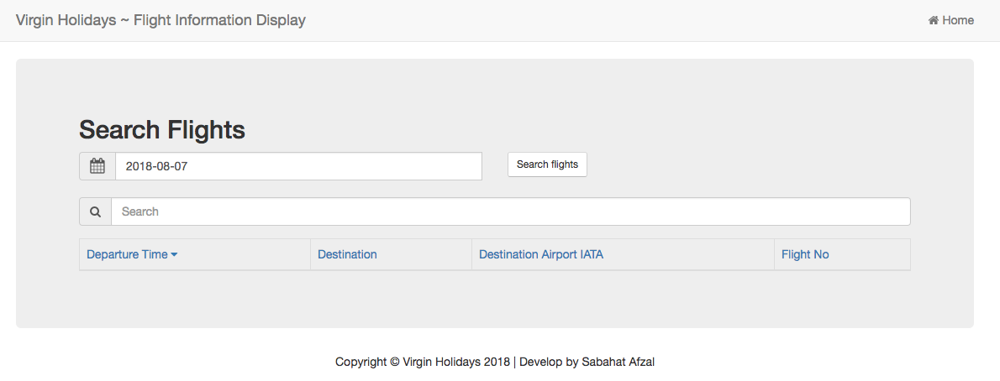
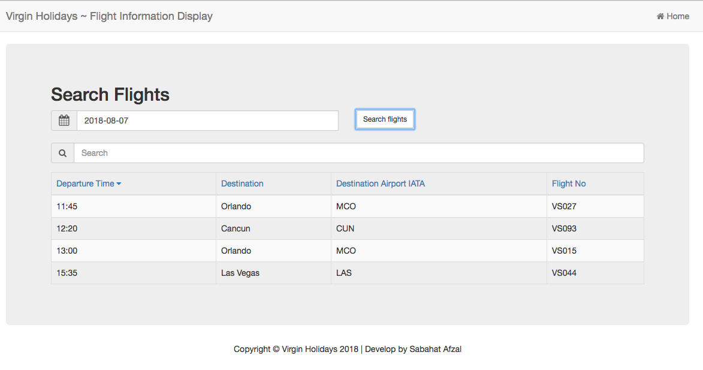
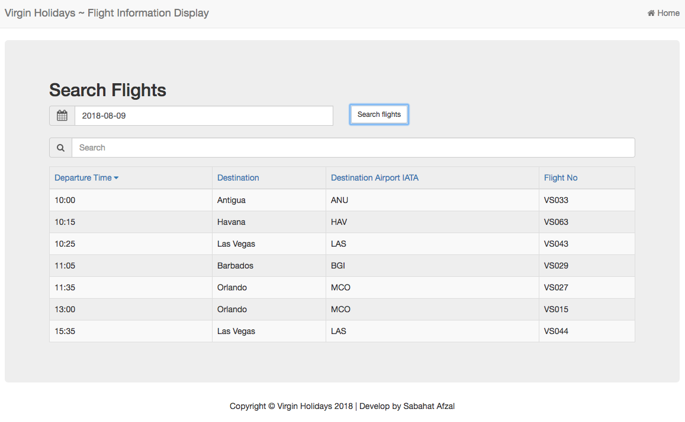
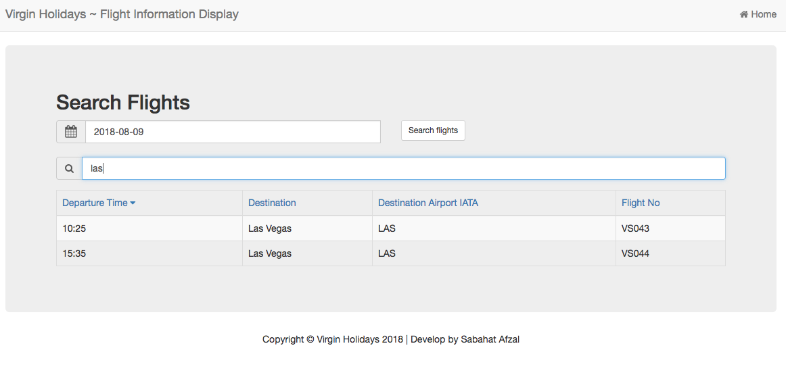

# Developer 
## Developed By Sabahat Afzal 
``` bash
The website is build on angular and has data-picker dependency and date format reference of these dependency is added in the code.
The website have the calendar view, which will only allow to select the dates from current date to future dates and current date also have the time validation.

In the table view by default we have the chronological order for a flight timing.
but if you want you can click on any columns name to change the order.
```

## Install On the Server

``` bash
# install dependencies
npm install  

```
# Screenshots
 
Home Page

Calendar

Today Flights 

Future Date

Search Flight



# Virgin Holidays ~ Flight Information Display
## Rules
You can write the application in any language you see fit, bearing in mind that its sole intention is to showcase your
skills for the applied-for position. 

In addition you should adhere to the following conditions:

1) It must be easy to run using libraries & tools commonly available on a development machine. 
1) Clear instructions for how to build and run the application should be included within the code, e.g. `README.md`
1) The code must be your own work. If you have a strong case to use a small code snippet of someone else's e.g. a
boilerplate function, it must be clearly commented and attributed to the original author.
1) The flight data cannot be changed, and must be loaded from the CSV file, so it can easily be replaced with another file.

## What it should do
The application should allow the user to select or input any date, of any year, resulting in the display of flights on
that day, displayed in chronological order -- a Flight Information Display.

The interface can be web-based, command-line or otherwise, but as already mentioned, you should choose the approach you
feel demonstrates your expertise and suitability for the position.

## Supporting Data
The [flight data](flights.csv) is a simple comma-separated file containing the following:

| Departure Time | Destination | Destination Airport IATA | Flight No | Sun | Mon | Tue | Wed | Thu | Fri | Sat
| :--- | :--- | :--- | :--- | :---: | :---: | :---: | :---: | :---: | :---: | :---: |
| 09:00 | Antigua | ANU | VS033 |  |  | `x` |  |  |  | 
| 10:00 | Antigua | ANU | VS033 |  |  |  |  | `x` |  | `x`
| 11:05 | Barbados | BGI | VS029 | `x` | `x` | `x` | `x` | `x` | `x` | `x`
| 12:20 | Cancun | CUN | VS093 |  |  | `x` |  |  |  | 
| 09:00 | Grenada | GND | VS089 |  | `x` |  |  |  |  | 
| 10:10 | Grenada | GND | VS089 |  |  |  |  |  | `x` | 
| 10:15 | Havana | HAV | VS063 |  |  | `x` |  |  |  | 
| 10:15 | Havana | HAV | VS063 |  | `x` |  |  | `x` |  | 
| 10:15 | Las Vegas | LAS | VS043 | `x` |  |  |  |  | `x` | `x`
| 10:25 | Las Vegas | LAS | VS043 |  |  |  |  | `x` |  | 
| 10:35 | Las Vegas | LAS | VS043 |  | `x` | `x` | `x` |  |  | 
| 15:35 | Las Vegas | LAS | VS044 | `x` | `x` | `x` | `x` | `x` | `x` | `x`
| 12:25  | Montego Bay | MBJ | VS065 |  |  |  | `x` |  |  | 
| 12:40 | Montego Bay | MBJ | VS065 | `x` |  |  |  |  |  | 
| 10:10 | Orlando | MCO | VS049 | `x` |  |  |  |  |  | 
| 10:15 | Orlando | MCO | VS027 |  |  |  | `x` |  |  | 
| 11:00 | Orlando | MCO | VS027 |  | `x` |  |  |  |  | 
| 11:10 | Orlando | MCO | VS049 |  | `x` |  |  |  |  | 
| 11:20 | Orlando | MCO | VS027 |  |  |  |  |  | `x` | `x`
| 11:35 | Orlando | MCO | VS027 |  |  |  |  | `x` |  | 
| 11:45 | Orlando | MCO | VS027 | `x` |  | `x` |  |  |  | 
| 11:45 | Orlando | MCO | VS049 |  |  |  | `x` |  |  | 
| 13:00 | Orlando | MCO | VS015 | `x` | `x` | `x` | `x` | `x` | `x` | `x`
| 09:00 | St Lucia | UVF | VS089 |  | `x` |  |  |  |  | 
| 09:00 | St Lucia | UVF | VS097 | `x` |  |  |  |  |  | 
| 10:10 | St Lucia | UVF | VS089 |  |  |  |  |  | `x` | 
| 09:00 | Tobago | TAB | VS097 | `x` |  |  |  |  |  |

The ``x`` denotes days that the flight operates. 

